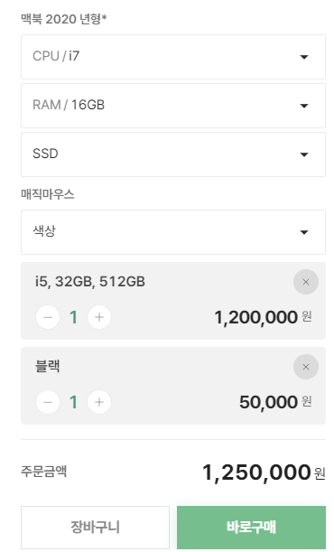

# 아키드로우 프론트 과제
## 개요
아키드로우의 프론트 개발자 채용에 지원해주셔서 감사합니다.

본 과제는 [TypeScript](https://github.com/microsoft/TypeScript) 와 [create-react-app](https://create-react-app.dev/docs/adding-typescript) 를 이용하여 생성된 프로젝트로써, 여러분은 이를 통하여 쇼핑몰의 매물 [IShoppingSale](src/api/structures/shoppings/sales/IShoppingSale.ts) 에 대한 상세 페이지를 구현하시면 됩니다. 

구현해야 할 매물에 대한 자료구조는, 소스 코드 상의 인터페이스 [IShoppingSale](src/api/structures/shoppings/sales/IShoppingSale.ts) 등을 읽어보시거나, 별도로 제공되는 [ERD 해설서](designs/description.md)를 읽어보시면 됩니다. 참고로 [IShoppingSale](src/api/structures/shoppings/sales/IShoppingSale.ts) 은 그 구조가 제법 복잡하고 상당히 깊은 계층성을 지녀, 이에 대한 개념을 먼저 이해하고 시작하셔야지, 대뜸 하드코딩부터 시작해서는 결코 제 시간에 풀 수 없도록 설계되었습니다.

더하여 저희가 본 과제에 대한 실 구현 사례 [맥북 2020 년형](https://dev-www.seesoop.com/shopping/sales/general/e03c604d-0bfb-4eaa-9c1c-967cf5c2daeb)을 보여드리기는 하나, 본 과제는 자료구조에 대한 해석력과 평소의 개발 습관에 대한 평가 등 기초 역량 검증이 목적이지, 디자인이나 CSS 등의 구현에 대한 디테일을 평가하기 위함이 아니니, CSS 없이 기본 HTML 태그만으로 제작하셔도 무관합니다.

  - 자료구조 인터페이스: [IShoppingSale](src/api/structures/shoppings/sales/IShoppingSale.ts) 등
  - ERD 해설서: [designs/description.md](designs/description.md)
  - 실 구현 사례: [맥북 2020 년형](https://dev-www.seesoop.com/shopping/sales/general/e03c604d-0bfb-4eaa-9c1c-967cf5c2daeb)
    - 구현에 대한 디테일이나 CSS 스킬 등은 평가치 아니함
    - 버그 발생시, 새로고침 해 주시면 정상 동작합니다

## 평가 요소
> 간단 요약
>
> - 기초가 튼튼한 지를 검증하기 위함
>   -  자료구조에 대한 독해 및 해석력이 평가 1 순위
>   - 정석적인 습관이 들여져야 제 시간에 풀 수 있는 문제
>   - 디자인이나 CSS 등의 구현에 대한 디테일은 보지 아니함
> - 과제 중 [IShoppingSale](src/api/structures/shoppings/sales/IShoppingSale.ts) 의 개념에 대한 질문 및 해설 요청 가능
> - 제한 시간: 기본 4 시간 + 2 시간

본 과제가 구현 대상으로 삼는 [IShoppingSale](src/api/structures/shoppings/sales/IShoppingSale.ts) 은, 누구에게나 친숙한 주제이되 그 구조가 제법 복잡하고 상당히 깊은 계층성을 띕니다. 때문에 예제 파일을 보면서 어수룩하게 하드코딩을 해서는, 결코 [IShoppingSale](src/api/structures/shoppings/sales/IShoppingSale.ts) 에 대한 뷰어를 제 때에 구현할 수 없습니다. 반드시 해당 자료구조에 대한 문서를 읽으며 그 개념과 원리를 이해하고 들어가야, 적시에 구현할 수 있습니다.

  - 자료구조 인터페이스: [IShoppingSale](src/api/structures/shoppings/sales/IShoppingSale.ts) 등
  - ERD 해설서: [designs/description.md](designs/description.md)
  - 실 구현 사례: [맥북 2020 년형](https://dev-www.seesoop.com/shopping/sales/general/e03c604d-0bfb-4eaa-9c1c-967cf5c2daeb)
    - 구현에 대한 디테일이나 CSS 스킬 등은 평가치 아니함
    - 버그 발생시, 새로고침 해 주시면 정상 동작합니다

즉 본 과제는, 계층성을 띄는 복잡한 구조의 데이터에 대하여, 지원자가 이를 얼마나 바르고 꼼꼼하게 이해하는 지를 측정하기 위하여 기획되었습니다. 더하여 지원자의 개발 성향이 하드코딩으로 점철되어있는지, 아니면 꼼꼼한 요구사항 분석과 설계를 토대로 개발하는 정도를 걷는지를 알아보기 위함입니다. 또한, 만일 본 과제를 풀면서 [IShoppingSale](src/api/structures/shoppings/sales/IShoppingSale.ts) 의 주요 개념에 대하여 잘 이해가 가지 않으시거든, 즉석에서 질문 내지 해설을 요청하셔도 무방합니다.

참고로 본 과제에서는 [IShoppingSale](src/api/structures/shoppings/sales/IShoppingSale.ts) 에 대한 상세 페이지를 구현함에 있어, 디자인이나 CSS 등의 구현에 대한 디테일은 일절 보지 아니합니다. TypeScript 와 React 라는 기본 틀을 벗어나지 않는 선에서라면, 그 어떠한 라이브러리나 프레임워크를 쓰셔도 좋고, 그 어떠한 CSS 스타일링 없이 기본 HTML 태그로만 상세 페이지를 구성하셔도 됩니다.

더하여 본 과제의 제출 기한은 기본 4 시간이되, 추가 시간 2 시간을 함께 부여합니다. 이로써 과제 제출 기한은 오후 7 시까지로 사실상 시간 제한이 없는 격이니, 시간에 쫓기지 마시고, 부디 자신의 기초 역량을 마음껏 뽐내주시기 바랍니다.

## 합격 기준
> 간단 요약
>
>  - 신입은 [옵션](src/api/structures/shoppings/sales/IShoppingSaleUnitOption.ts)과 [스톡](src/api/structures/shoppings/sales/IShoppingSaleUnitStock.ts)의 관계를 표현할 수 있으면 바로 합격
>  - 경력자는 [스톡](src/api/structures/shoppings/sales/IShoppingSaleUnitStock.ts) 탐색 알고리즘 최적화까지 성공시 바로 합격
>  - 그렇지 않다면 나머지 기능을 전부 구현해야 합격

본 과제의 [IShoppingSale](src/api/structures/shoppings/sales/IShoppingSale.ts) 에서 가장 어려운 부분이 바로, select 타입의 옵션들과, 그 [옵션](src/api/structures/shoppings/sales/IShoppingSaleUnitOption.ts)들을 선택함으로써 확정되는 [최종 구성품(스톡)](src/api/structures/shoppings/sales/IShoppingSaleUnitStock.ts)에 대한 표현입니다. 제공되는 실 구현 사례 [맥북 2020 년형](https://dev-www.seesoop.com/shopping/sales/general/e03c604d-0bfb-4eaa-9c1c-967cf5c2daeb) 중에서는 상단 우측 페이지, [옵션](src/api/structures/shoppings/sales/IShoppingSaleUnitOption.ts)을 선택하면 주문할 [최종 구성품(스톡)](src/api/structures/shoppings/sales/IShoppingSaleUnitStock.ts)이 결정되는 부분에 해당합니다.

만일 **신입** 지원자 분께서 과제 중에 바로 이 [옵션](src/api/structures/shoppings/sales/IShoppingSaleUnitOption.ts)과 [스톡](src/api/structures/shoppings/sales/IShoppingSaleUnitStock.ts)을 구현하는 데 성공하시거든, 다른 기능들의 구현 여부나 UI 퀄리티에 관계없이, **합격** 드리겠습니다. **경력자** 분께서는 [스톡](src/api/structures/shoppings/sales/IShoppingSaleUnitStock.ts) 탐색 알고리즘 **최적화**까지 해 주시거든 즉시 **합격**입니다. 즉 지원자께서 전략적으로 옵션과 스톡에 대하여만 구현하시고, 그 외에 무엇도 구현치 않은채 그대로 귀가하셔도, **무조건 합격**입니다. 

반대로 이 [옵션](src/api/structures/shoppings/sales/IShoppingSaleUnitOption.ts)과 [스톡](src/api/structures/shoppings/sales/IShoppingSaleUnitStock.ts)에 대한 구성을 포기하시거든, 그 외의 모든 요소들을 구현하셔야 합니다.

  - 제품 카탈로그 명: 맥북 2020 년형
  - [옵션](src/api/structures/shoppings/sales/IShoppingSaleUnitOption.ts)
    - CPU: i3, i5, i7
    - RAM: 8 GB, 16 GB, 32 GB, 64 GB
    - SSD: 256 GB, 512 GB, 1 TB
  - 최종 구성품, [스톡](src/api/structures/shoppings/sales/IShoppingSaleUnitStock.ts) 수: 36 개 (3 x 4 x 3)
    - CPU 3 개
    - RAM 4 개
    - SSD 3 개

## 과제 제출
본 프로젝트를 본인의 깃허브 저장소로 올리신 후, 해당 저장소의 주소를 공유해주세요.